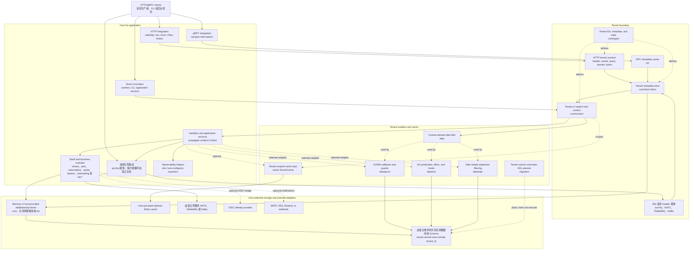
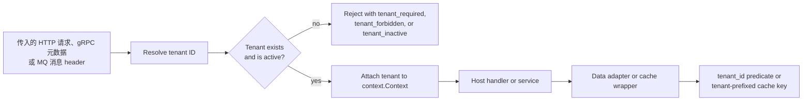

# 架构

[EN](architecture.md) | [中文](architecture.zh-CN.md)

SaaS 是一个组装到宿主 Go 应用中的库；它本身不运行 HTTP/gRPC 服务、消息队列 Broker、Broker 客户端连接或物理部署基础设施。本图展示了该模块实现的集成边界以及常规的租户作用域请求路径。存储、消息队列和外部系统节点由宿主选择和配置；它们是受支持的集成点，而不是本仓库部署的服务。

## 租户作用域请求路径

## 边界规则

- HTTP 和 gRPC 集成会解析租户、加载其元数据，并要求租户处于活跃状态，之后才将控制权交给宿主应用。
- 配置可选部署解析器后，这些集成会在租户查询成功后解析其逻辑部署单元，并将其写入同一个 `context.Context`。该目录不会选择数据库连接、路由流量或搬迁数据；这些操作仍由宿主负责。参阅[部署单元](deployment.zh-CN.md)。
- `rpc/mq` 只适配 NATS、RabbitMQ 和 Kafka 的消息 header。出站工作中，宿主从已经建立的租户上下文调用 `rpc.InjectTenant`；入站工作中，宿主调用 `rpc.ExtractTenant`，通过 `core/store.Store` 加载租户、确认其处于活跃状态，然后在分发消息前调用 `core/context.WithTenant`。
- 所有 Broker I/O 和消息策略均由宿主负责。MQ 适配器不会建立连接、发布或消费消息、确认消息、执行重试或死信处理，也不会校验租户元数据。
- `context.Context` 是作用域载体。后台任务必须显式建立租户上下文；全局主机操作必须使用有意为之的 `core/context.WithHost` 路径。
- GORM、Ent 和 sqlx 适配器从该上下文派生数据边界。在受支持的共享数据库、共享 Schema 模型中，租户所有的行都带有 `tenant_id`；本模块不实现按租户独立数据库、独立 Schema 或混合隔离。
- 存储可以使用内存实现，也可以使用宿主提供的 SQL 连接。Redis 是可选的、由宿主提供的缓存适配器，而不是租户隔离的来源。
- `migration.Planner` 生成租户感知的 DDL 和 seed 语句；它从不执行迁移。

有关包级接口，请参阅 [API 参考](api.zh-CN.md)；有关详细的防护行为，请参阅[安全性](security.zh-CN.md)。
